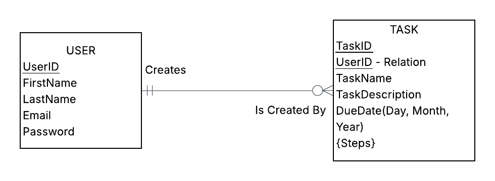

# README

## Task Manager Project Description
- User can log in and view a dashboard of tasks they need to complete 
- Each task can have built in checklists for sub-tasks to break it down into simpler steps
- Marking all subtasks as complete will mark the task as complete
- Once task is marked as complete it is removed from the main dashboard but can be viewed from completion history
- Each task will have an assigned completion date, and they will be displayed in order of most upcoming
- User has the option to create new tasks as well as edit and delete existing tasks

## Business Rules
A USER may create any number of TASKs. Each TASK is created by only one USER.

## ERD Diagram
Diagram demonstrating the relationship between the core entities of the database and help understand how each one is connected as well as any hierarchies and dependencies.

## Relation Diagram
Helps plan out the eventual database tables by presenting the entities as table rows. Breaks down any composite attributes and seperates out any multi-valued attributes. More detailed information on how the keys connect all the entities.
